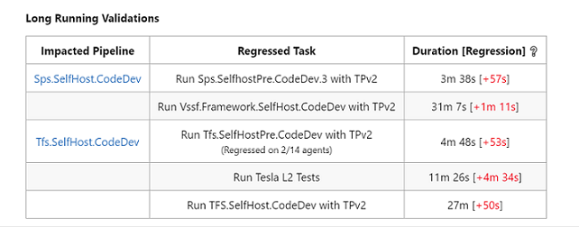

# Pull Request Insights for Azure DevOps Marketplace

Pull Request Insights is an extension for Azure DevOps that provides insights into pipelines.
This extension has two main functions:

1. Investigating pull request validation failures
2. Alerting pull request owners to the introduction of long running tasks.

All insights are provided in the form of a comment on the page of the pull request that triggered the validation.

### Validation Failure Insights

When a pull request validation fails, it is often unclear whether the failure is a result of changes introduced by the pull request
owner or if the failure was due to existing problems on the target branch. This extension aims to combat this issue by giving insight
into possible causes of the failure and suggested actions for the PR owner to take.


### Long Running Validation Insights

Pull requests may inadvertently introduce regression for tasks within pipelines without awareness of the PR owner. This
extension gives insights into this problem by calculating and displaying regression, allowing the PR owner to decide
if their changes are reasonable to introduce.



# Telemetry

This extension collects telemetry data. We report the following data:

- User inputs
- Pipeline id and host type
- Task results (regression found, failure found, comment needed)

# Contributing

This project welcomes contributions and suggestions. Most contributions require you to agree to a
Contributor License Agreement (CLA) declaring that you have the right to, and actually do, grant us
the rights to use your contribution. For details, visit https://cla.opensource.microsoft.com.
When you submit a pull request, a CLA bot will automatically determine whether you need to provide
a CLA and decorate the PR appropriately (e.g., status check, comment). Simply follow the instructions
provided by the bot. You will only need to do this once across all repos using our CLA.
This project has adopted the [Microsoft Open Source Code of Conduct](https://opensource.microsoft.com/codeofconduct/).
For more information see the [Code of Conduct FAQ](https://opensource.microsoft.com/codeofconduct/faq/) or
contact [opencode@microsoft.com](mailto:opencode@microsoft.com) with any additional questions or comments.

To build:
Navigate to pullRequestInsightsTask folder and run

```
tsc
npm install
```

To run unit tests:
Navigate to pullRequestInsightsTask folder and run

```
npm test
```

To try the task without installing it on a pipeline, the file .\azure-pipelines-prinsights\pullRequestInsightsTask\tests\_\_e_to_e_tests\_\_\invokeTest.js
can be run to invoke an end to end test.
Before running the test, all variables should be set within the test in order to simultate the environment configurations the extension
would access when running as a task within a pipeline.
To run the test, enter the pullRequestInsightsTask folder and run

```
tsc
node C:\azure-pipelines-prinsights\pullRequestInsightsTask\tests\_\_e_to_e_tests\_\_\invokeTest.js
```

For information on packaging the extension code into a vsix file, see [this page](https://docs.microsoft.com/en-us/azure/devops/extend/develop/add-build-task?view=azure-devops#packageext).

####
